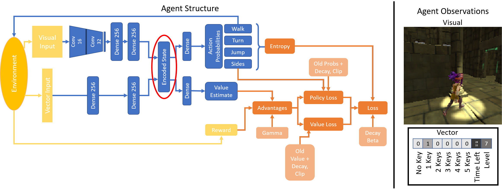
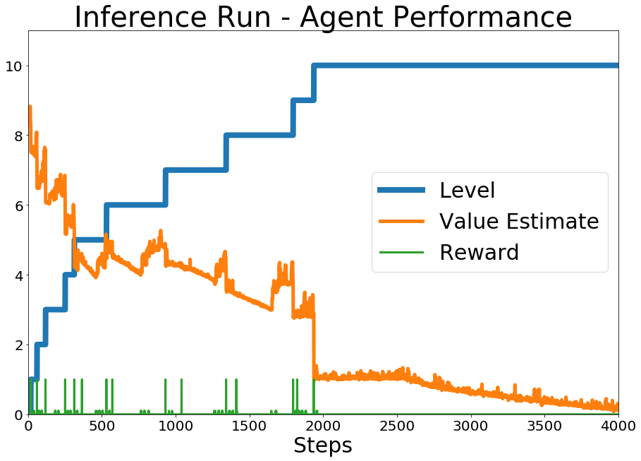
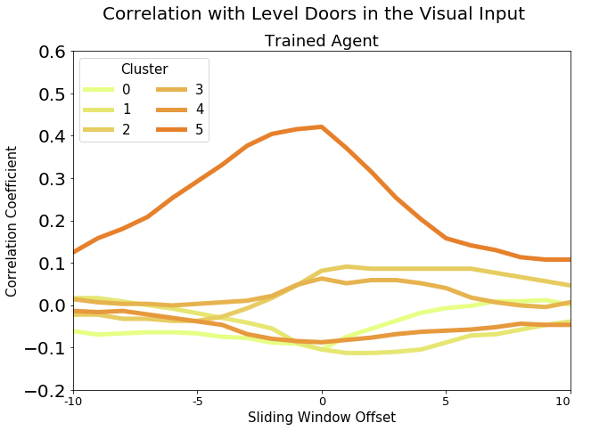
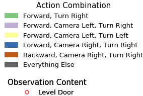

# Learning Semantically Meaningful Representations Through Embodiment
<a href="ICLR Paper - Data Analysis.html" target="_blank"> Here </a> you can find the Jupyter Notebook used to generate the figures and animations on this page and in the submission.

View HTML with interactive content <a href="https://embodiedlearning.github.io/ICLR-Submission/" target="_blank"> here </a>.

<iframe width="560" height="315" src="https://www.youtube.com/embed/ppRLisL9WbM?end=38" frameborder="0" allow="accelerometer; autoplay; encrypted-media; gyroscope; picture-in-picture" allowfullscreen></iframe>

## The Agents Brain and How it Learns
I use proximal policy optimization (PPO) to train the agent. Figure 1 shows the underlying network structure (blue). The agent makes decisions based on visual and vector observations provided by the environment (yellow). Vector observations are composed of the time left, the number of key which the agent possesses and the level in which he finds himself.

We will now look at the agents brain in one particular run. Figure 2 shows the overall statistics of this run. You can see that the agent reached level 10 within less than 2000 steps.

## Activity in the Agents Brain
The following animation shows the embedded layer activations in the agents brain (left) with the corresponding visual observations (right) and the actions which the agent selects. R and V indicate the obtained reward from the environment and the value estimate respectively.

<iframe width="100%" height="350" frameborder="0" scrolling="auto" src="content/anim_encodings.html"></iframe>

## K-Means Clustering on the Visual Activations

In Figure 3 (left) you can see the distribution of images in the 6 clusters calculated with k-means clustering. On the right you can see the within class variance for each cluster. The clustering is performed on the embedding of the visual observations (256 dimensions). When looking at the images in the different clusters one can make out some semantic patterns. Some cluster contain images where the agent walks through doors or sees other rewarding events coming such as blue spheres or keys (for instance see cluster 5), other clusters contain frames where the agent simply walks through rooms (cluster 1) while others for example contain hard right/left turns or backwards motion (cluster 2). Feel free to also explore the images in the 6 class clustering (number of cluster with least within class variance).

<iframe width="100%" height="1000" frameborder="0" scrolling="auto" src="content/anim_k-means.html"></iframe>

In the figure below one can see that the clusters don't only have a meaningful structure in regard to the actions they contain but also the content of the image. One can see that for example the information if a level door is observed is represented in the visual encoding and in this clustering those frames are mainly placed within cluster 5.

## T-SNE on the Visual Embeddings
Hover with your curser over the data points to see the corresponding observations of the agent for each point.

<iframe width="100%" height="750" frameborder="0" scrolling="auto" src="content/tsne.html"></iframe>

